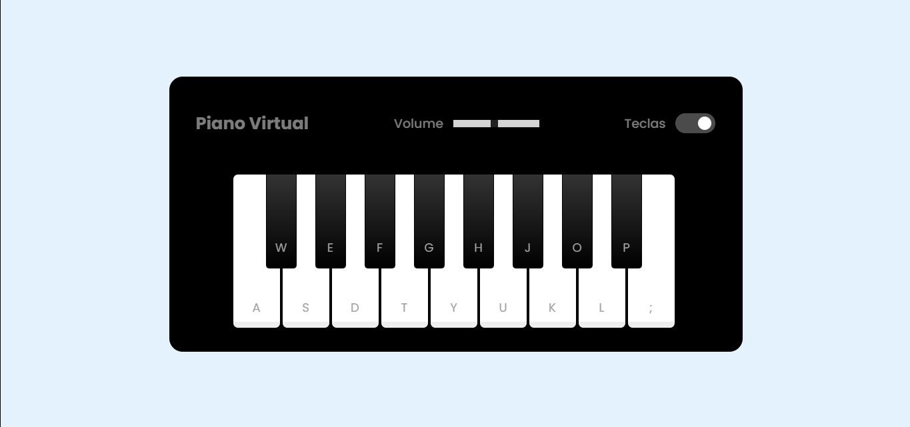

# 🎹 Piano Virtual - Toque Músicas Direto no Seu Navegador!

[](https://github.com/DanAntunes/piano-simulator/blob/main/LICENSE)
[](https://developer.mozilla.org/pt-BR/docs/Web/HTML)
[](https://developer.mozilla.org/pt-BR/docs/Web/CSS)
[](https://developer.mozilla.org/pt-BR/docs/Web/JavaScript)

Um piano digital interativo que transforma seu navegador em um instrumento musical! Crie melodias incríveis usando teclado ou mouse, ajuste o volume e personalize sua experiência. 🎶

  

## ✨ Destaques
- 🎮 Controle por **teclado** ou **mouse**
- 🔊 Controle deslizante de volume integrado
- 🎨 Design moderno e responsivo
- 🔄 Alternar visibilidade das legendas
- 📱 Compatível com dispositivos móveis

## 🚀 Começando

### Pré-requisitos
- Navegador moderno (Chrome, Firefox, Safari)
- Conexão com internet (para fontes externas)

### Instalação Rápida
```bash
# Clone o repositório
git clone https://github.com/DanAntunes/piano-simulator.git

# Acesse a pasta do projeto
cd piano-simulator

# Abra no navegador
start index.html  # Windows
open index.html   # macOS
xdg-open index.html  # Linux
```

## 🎛️ Como Usar
| Funcionalidade       | Como Acessar                          |
|----------------------|---------------------------------------|
| Tocar notas          | Clique nas teclas ou use o teclado    |
| Ajustar volume       | Controle deslizante na interface      |
| Alternar legendas    | Botão "Mostrar Teclas"                |
| Modo Mobile          | Gire o dispositivo para melhor experiência |

### 🎹 Mapeamento de Teclas
| Teclas Brancas       | Teclas Pretas         |
|----------------------|-----------------------|
| A S D F G H J K L    | W E T Y U O P         |
| C D E F G A B C      | C# D# F# G# A# C# D# |

## 🛠️ Tecnologias
  
- **Normalize.css** - Padronização de estilos
- **Google Fonts** - Fonte Poppins
- **Web Audio API** - Processamento de sons

## 📂 Estrutura do Projeto
```bash
piano-simulator/
├── index.html            # Página principal
├── src/
│   ├── assets/
│   │   ├── css/         # Estilos e media queries
│   │   ├── scripts/     # Lógica do piano
│   │   └── tunes/       # Arquivos de áudio .wav
└── README.md            # Você está aqui :)
```

## 🌟 Recursos Futuros
- [ ] Seleção de diferentes instrumentos
- [ ] Gravação e reprodução de melodias
- [ ] Modo aula com músicas guiadas
- [ ] Compartilhamento de composições

## 🤝 Contribuindo
Sua ajuda é bem-vinda! Siga estes passos:
1. Faça um Fork do projeto
2. Crie sua Branch (`git checkout -b feature/IncrivelFeature`)
3. Commit suas Mudanças (`git commit -m 'Adicionando recurso incrível'`)
4. Push para a Branch (`git push origin feature/IncrivelFeature`)
5. Abra um Pull Request

## 📄 Licença
Distribuído sob licença MIT. Veja o arquivo [LICENSE](LICENSE) para mais informações.

---

Feito com ❤️ por [Dan Antunes](https://github.com/DanAntunes)  
🎶 Deixe sua criatividade fluir e crie algo incrível!
